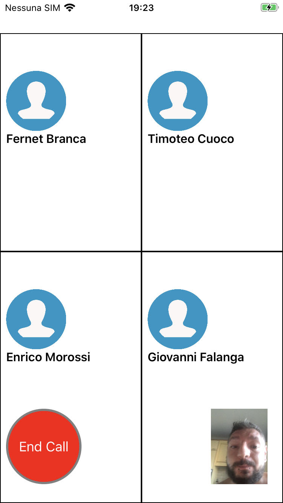

# CallMeMaybe
Mock for a Video Call written in Swift for  iOS >= 9

The App uses Stevia Framework for View layout, has its core functionality unit-tested, and fake User Credentials are stored in KeyChain via SwiftKeychainWrapper

**Login Screen**

**Contacts Screen**

**Camera Call Screen**

